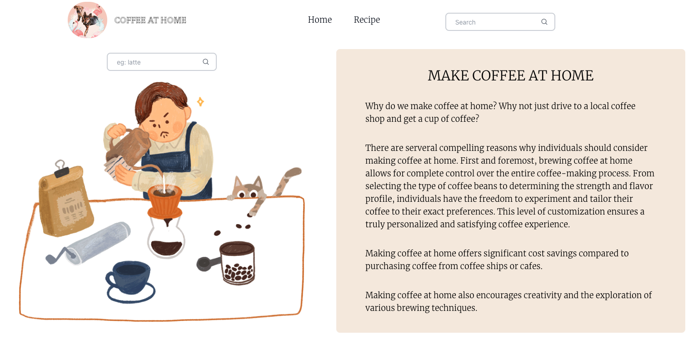
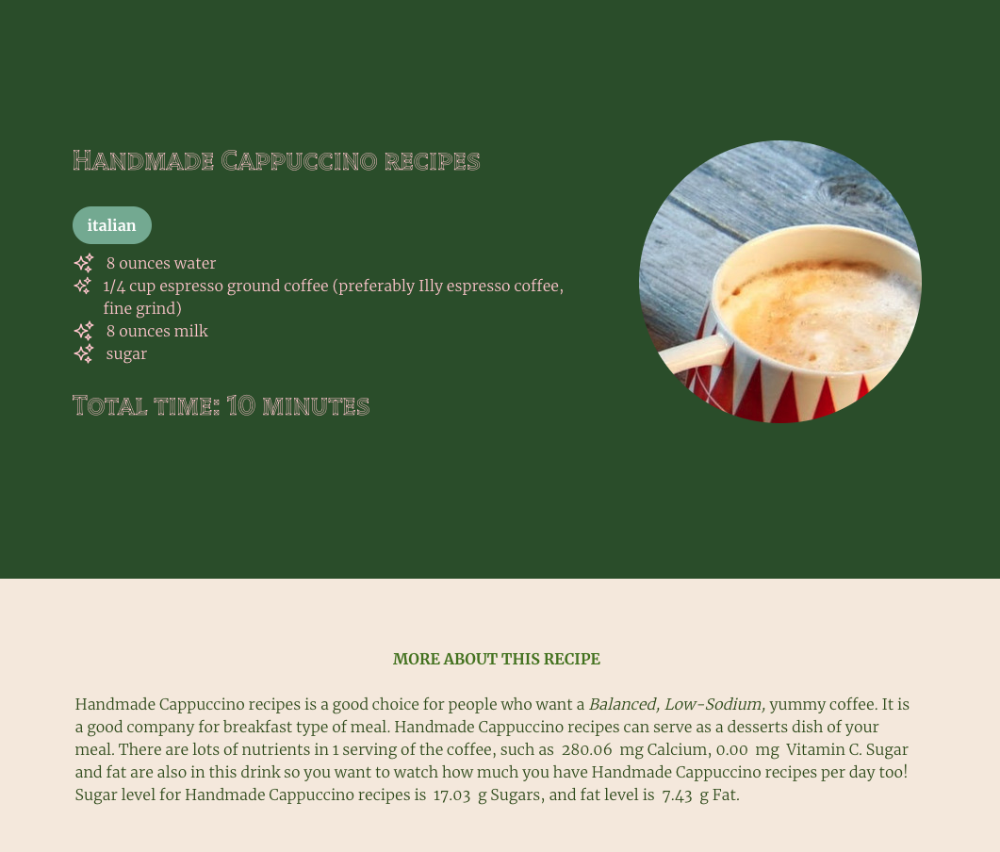

# Coffee At Home

Coffee At Home is an app designed to find recipes and make delicious and budget-friendly coffee at home. This is a mobile first app.

Users can browse 20 randomized recommended recipes and search different recipes. 

# Technologies

* [JavaScript](https://www.javascript.com/)
* [React](https://reactjs.org/)
* [Redux](https://redux.js.org/)
* [Node.js](https://nodejs.org/en/)
* [Tailwind](https://tailwindcss.com/)

# Minimum Viable Product

- Display 20 random recipes
- Search various recipes based on users' inputs

# Stretch Goals To Be Completed
- Filter features for finding recipes with requirements of sugar, fat, allergies, etc. 

# Screenshots of The Application

- Home Page:

- Search Page:

- Search Results:

- Recipe Detail: 

